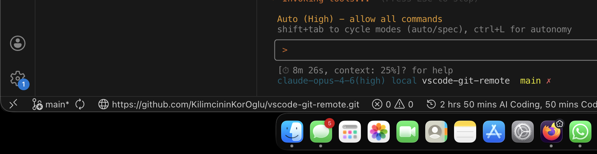

# Git Remote URL

A Visual Studio Code extension that displays the current git remote URL in the status bar.



## Features

- Displays the full git remote URL in the status bar with a globe icon
- Shows a warning indicator when no remote is configured
- Supports multiple remotes with a quick pick selector
- Sets `remote.pushDefault` when a remote is selected, making it the default for `git push`
- Automatically updates when git remotes change

## Usage

Once installed, the extension activates automatically and shows the remote URL in the status bar.

- **Single remote**: The remote URL is displayed directly
- **Multiple remotes**: Click the status bar item to select which remote to display and set as the default push remote
- **No remote**: A "No Remote" warning is shown

## Commands

| Command                     | Description                                                      |
|:----------------------------|:-----------------------------------------------------------------|
| `Git Remote: Select Remote` | Choose which remote URL to display (when multiple remotes exist) |

## Requirements

- Visual Studio Code 1.85.0 or later
- A workspace with a git repository

## Installation

Download the latest `.vsix` file from the [Releases](https://github.com/KilimcininKorOglu/vscode-git-remote/releases) page and install it:

```bash
code --install-extension vscode-git-remote-<version>.vsix
```

Or install from VS Code: `Extensions` > `...` > `Install from VSIX...`

## Development

```bash
npm install
npm run build
```

Press `F5` in VS Code to launch the Extension Development Host for testing.

## Release

A new release is automatically created via GitHub Actions when a version tag is pushed:

```bash
git tag v<version>
git push origin v<version>
```

## License

MIT
